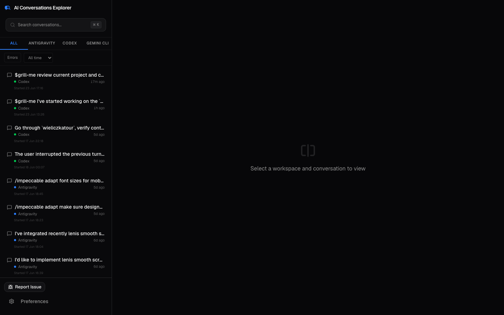
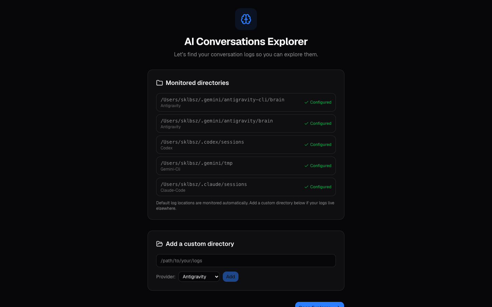
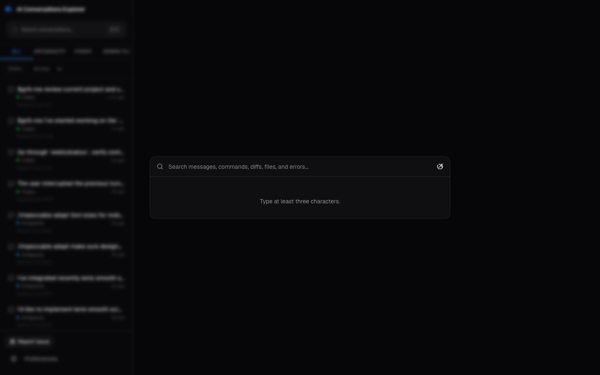
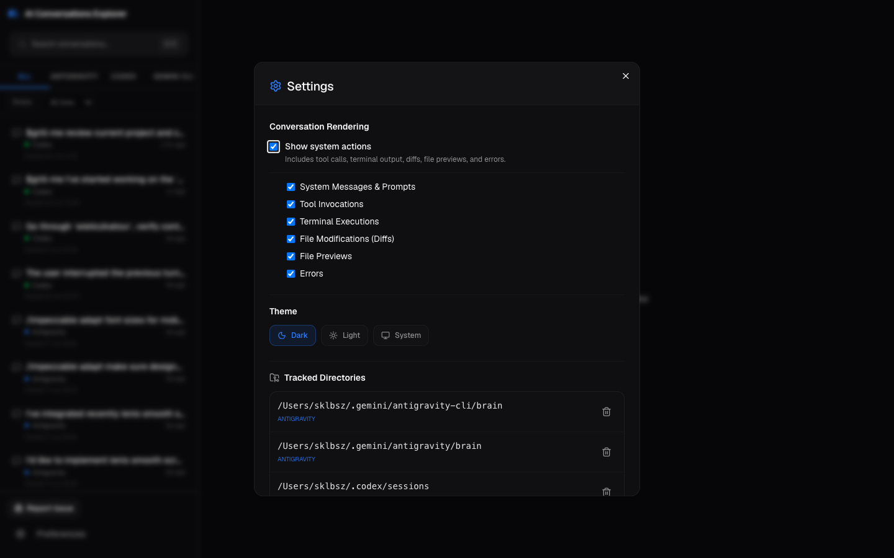

<div align="center">
  
  <h1>AI Conversations Explorer</h1>
  <p><strong>Desktop explorer for your CLI coding-agent conversations</strong></p>
  <p>Search, browse, and inspect every session from Codex, Claude Code, Antigravity, and Gemini CLI — all on your machine, nothing leaves.</p>
  <br />
  <p>
    <a href="#features">Features</a> &nbsp;•&nbsp;
    <a href="#screenshots">Screenshots</a> &nbsp;•&nbsp;
    <a href="#supported-providers">Providers</a> &nbsp;•&nbsp;
    <a href="#getting-started">Getting Started</a> &nbsp;•&nbsp;
    <a href="#development">Development</a> &nbsp;•&nbsp;
    <a href="#privacy">Privacy</a>
  </p>
  <br />
  <p>
    
    
    
    
  </p>
</div>

---

> **AI Conversations Explorer** is a privacy-first desktop app that scans your local CLI coding-agent session archives and presents them in a single, searchable interface. It's like having a unified history browser for all the AI pair-programming sessions that have happened on your machine.
>
> **Status:** Public Beta — macOS only, actively developed.

---

## Features

**🔍 Full-Text Search** — Search across every message, tool call, terminal command, diff, file preview, and error across all providers. Results link directly to the matching step in the transcript. Powered by SQLite FTS5.

**🗂️ Multi-Provider Unified View** — Browse conversations from Codex, Claude Code, Antigravity, and Gemini CLI in one place. Filter by provider, date range, or view only sessions with errors.

**📜 Full Transcript Viewer** — Read the complete back-and-forth of any session with rendered Markdown, collapsible system events, structured metadata (XML context blocks), timing info, and token usage.

**🛠️ Tool Call & Diff Viewer** — Inspect every tool invocation, terminal execution, file modification diff (syntax-highlighted additions/removals), and file preview — grouped and collapsible for easy scanning.

**♾️ Infinite Scroll** — Navigate thousands of sessions effortlessly with virtualized infinite scrolling. No pagination clicks, just keep scrolling.

**🔒 100% Local & Private** — All data stays on your machine. Uses local SQLite storage. No telemetry, no cloud sync, no data leaves your computer. Manual issue reports include scan metadata only — never conversation contents.

**🎨 Dark & Light Themes** — Full dark and light mode support, plus automatic system-aware theming. Carefully tuned OKLCH color palette for readability in any environment.

**📁 Custom Directory Scanning** — Add any directory containing session logs. The scanner automatically discovers new sessions, tracks content hashes to avoid re-scanning, and adapts to provider-specific formats.

---

## Screenshots

### Main View



### Onboarding



### Search (⌘K)



### Settings



---

## Supported Providers

| Provider | Format | Default Path | Status |
| --- | --- | --- | --- |
| **Codex** | SQLite + JSONL | `~/.codex/sessions` | ✅ Stable |
| **Claude Code** | JSONL transcripts | `~/.claude/sessions` | ✅ Stable |
| **Antigravity** | Protobuf + JSONL | `~/.gemini/antigravity-cli/brain` | ✅ Stable |
| **Gemini CLI** | JSONL chats | `~/.gemini/tmp` | ✅ Stable |
| Custom paths | Any directory | User-defined | ✅ Supported |

Default directories are registered automatically on first launch. Custom directories can be added from Settings or onboarding.

---

## Getting Started

### Download

Download the latest DMG from the [Releases page](https://github.com/aimemory/explorer/releases). Supports both Apple Silicon and Intel Macs.

### Build from Source

Prerequisites: [Bun](https://bun.sh) and a [Rust](https://rustup.rs) toolchain.

```bash
git clone https://github.com/aimemory/explorer.git
cd explorer
bun install
bun run tauri-dev        # Launch in development mode
bun run tauri-build      # Build a macOS .app bundle
```

### First Launch

On first launch, the app auto-registers default session directories for all supported providers. The scanner runs in the background every 60 seconds, discovering new sessions incrementally and skipping unchanged files via content hashing.

---

## Development

### Stack

| Layer | Technology |
| --- | --- |
| Frontend | React 19, TypeScript, Tailwind CSS v4, Framer Motion |
| UI Components | shadcn/ui, Base UI, Lucide icons |
| Backend | Bun + Elysia + tRPC |
| Database | SQLite (WAL mode) with FTS5 full-text search |
| Desktop Shell | Tauri v2 (Rust) |

### Commands

```bash
bun install                    # Install dependencies
bun run tauri-dev              # Desktop dev mode
bun run dev                    # Web-only dev mode (frontend + backend)
bunx tsc --noEmit              # Type-check
bun test                       # Run tests
bun run tauri-build            # Production build
bun run build:sidecar          # Build standalone backend binary
```

### Project Structure

```text
src/
├── frontend/           # React UI
│   ├── components/     # ChatMessage, SearchDialog, SettingsDialog, ...
│   ├── App.tsx         # Main view: sidebar + transcript viewer
│   └── theme.tsx       # Dark/light/system theme provider
├── backend/            # Elysia + tRPC server
│   ├── index.ts        # tRPC router definitions
│   ├── db.ts           # SQLite database layer
│   ├── scanner.ts      # Background file scanner
│   ├── scanner-core.ts # Scanning logic & file enumeration
│   └── adapters/       # Provider-specific parsers
│       ├── codex/      # Codex session adapter
│       ├── claude-code/# Claude Code adapter
│       ├── antigravity/# Antigravity (Protobuf) adapter
│       └── gemini-cli/ # Gemini CLI adapter
├── shared/             # Shared types & constants
└── components/ui/      # shadcn/ui primitives
```

### Architecture

Each provider implements a `ProviderAdapter` interface that provides:

- **`getMetadata()`** — Lightweight metadata extraction for fast listing (title, project, timing, error status)
- **`getTranscript()`** — Full transcript parsing with step-by-step conversation, tool calls, and system events
- **`getThreadTree()`** — Thread hierarchy for subagent/spawned sessions

The scanner tracks file content hashes (SHA256) to skip unchanged files on subsequent runs, and records fallback tiers to indicate data quality (clean DB parsing → partial parse → corrupted-file recovery).

---

## Privacy

AI Conversations Explorer is built with privacy as a first principle:

- ✅ All processing is local — no data is ever sent to a remote server
- ✅ No analytics, no telemetry, no crash reporting
- ✅ Issue reports are manual and include only scan summary metadata (file counts, durations) — not conversation contents
- ✅ You control every directory that gets indexed
- ✅ The FTS5 search index lives in your local SQLite database

---

## Roadmap

- [ ] Additional provider support (Cursor, Windsurf, Continue.dev)
- [ ] Linux support
- [ ] Conversation fork/thread-tree visualization
- [ ] Export transcripts as Markdown/JSON
- [ ] Bookmark and annotate individual steps
- [ ] Statistical dashboard (token usage trends, provider comparison)

---

## Contributing

Contributions are welcome! See [open issues](https://github.com/aimemory/explorer/issues) for things to work on, or open a new one.

```bash
git clone https://github.com/aimemory/explorer.git
cd explorer
bun install
bun run tauri-dev
```

Please ensure checks pass before submitting pull requests:

```bash
bunx tsc --noEmit
bun test
```

---

## License

[MIT](LICENSE) © 2026 AI Conversations Explorer contributors

---

## Keywords

<!-- This section improves search discoverability on GitHub and Google. -->
ai conversations explorer, claude code, codex cli, gemini cli, antigravity, coding agent history, llm session browser, ai pair programming, terminal agent logs, conversation search, tauri desktop app, react desktop, sqlite fts5, privacy-first, local-first, developer tools, macos app, ai coding assistant, agent transcript viewer, session archive explorer
